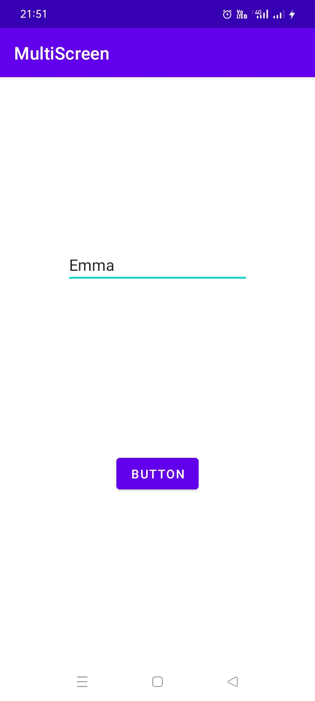
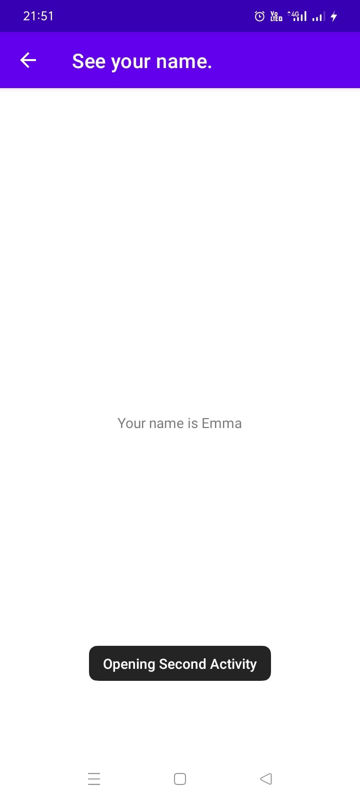

#<h1 align="center"> MultiScreenApp App</h1>
<table align="center">
    <thead>
        <tr>
          <th colspan="2"><b>Screenshots</b></th>
        </tr>
    </thead>
    <tbody>
        <tr>
            <td>Activity 1</td>
            <td>Activity 2</td>
        </tr>
        <tr>
            <td></td>
            <td></td>
        </tr>
    </tbody>
</table>

